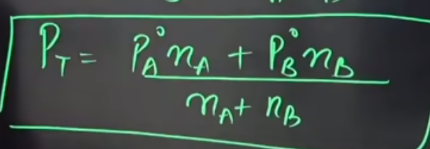

<h1 align='center'>Chemistry</h1>

# Solutions
- A solution is a homogeneous mixture of two or more than two components.
- A solution can have one or more than one solutes and always have one solvent. Solvent and solutes are the components of the solution
- Binary solution is that solution which have 1 solute and 1 solvent.
- Ternary solution is that solution which have 2 solutes and 1 solvent.
- Quatenary solution is that solution which have 3 solutes and 1 solvent.
- Solute is the reactive part and the solvent provides medium for the reaction
- The amount of solute in a solution is represented by concentration of the solution

> ## Concentration
> It measures the amount of solute in the solution
> - **Molarity (M)**: It is the number of moles of solute present per litre of the solution.
> - **Molality (m)**: It is the number of moles of solute present per kilogram of the solution.
> - **Molality is independent from temperature. But Molarity depends on temperature.**
> - Mass of solution = Mass of solvent + Mass of solute
> - **Mass/Volume %**: It is the grams of solute present per 100 ml of the solution
> - **Mass/Mass % or Mass %**: It is the grams of solute present per 100 grams of the solution.
> - **Volume/Volume% or Vol %**: It is the mililitre of solute present per 100 ml of the solution.
> - **Mole Fraction (χ)(chi)**: It is the fraction of the number of moles of the solute and total number of moles of the solution. χA + χB + χC ... χn = 1
> - **PPM (Parts per Million)**: It is the number of grams of solute per 106 grams of solution.

> ## Vapour Pressure
> - **Vapour pressure** is the maximum pressure exerted by a vapour in equilibrium with the liquid.
> - Vapour pressure represents the pressure of the saturated vapour.
> - Vapour pressure depends only on the temperature and nature of liquid
> - Vapour pressure doesn't depend on volume of the container or amount of the liquid.
> - Volatile solution have vapour pressure.
> - Non-volatile solution don't have vapour Pressure
> ---
> ### Roult's Law of Vapour Pressure
> - **Partial Pressure** of any component is **proportional** to the **mole fraction** of that component in the **liquid solution**.
> - Let's consider a solution with two components A and B. Their total pressure will be **PT = PA+PB. PA** is directly proportional to the **χA**. So, we can say that **PA = poAχB**. Same we can consider for the solution B. Then the total volume press ure of the solution is **poAχA+poBχB**. This is **Roult's Law**.
> 
> 